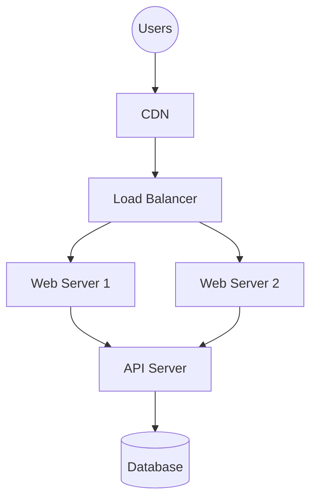

# Architecture Diagram Prompt

## Reasoning Rules

- Organize into layers: Frontend → Backend → Data
- Left-to-right or top-to-bottom flow
- Maximum 3 layers per diagram
- Maximum 7 nodes total
- Group related components into frames/subgraphs

## Styling Constraints

- Maximum 5 colors
- Leave 120px margin on all sides
- Use local library icons first (`library/icons.json`)
- Hand-drawn roughness: 1 (sketchy) / 0 (professional)

## Mermaid Example

