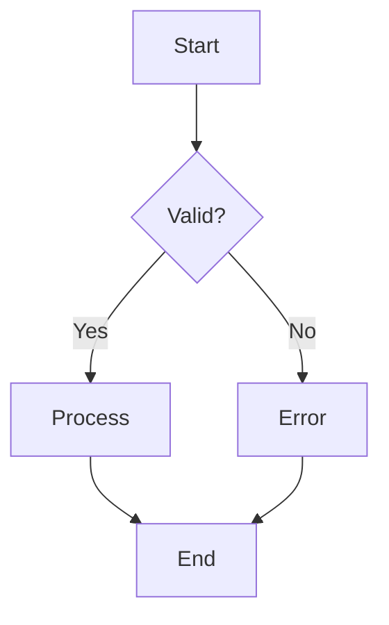

# Flowchart Prompt

## Reasoning Rules

- Decision nodes must have exactly 2 outgoing branches (Yes/No)
- Maximum 10 nodes total
- Start node at top, end node at bottom
- Process steps as rectangles, decisions as diamonds

## Styling Constraints

- Maximum 5 colors
- Leave 120px margin
- Use distinct shapes: rect for process, diamond for decision, rounded for start/end
- Hand-drawn roughness: 1

## Mermaid Example

