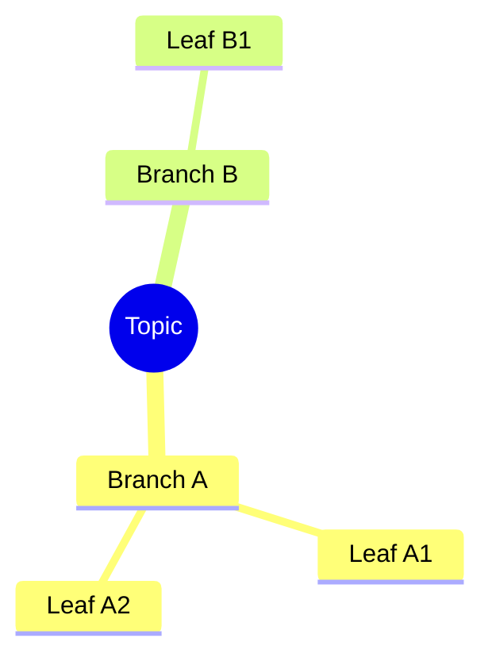

# Mindmap Prompt

## Reasoning Rules

- Center node = topic
- Maximum 3 levels deep
- Maximum 6 branches from center
- Group related concepts into branches
- Use single words or short phrases per node

## Styling Constraints

- Maximum 5 colors (one per branch)
- Leave 120px margin
- Radial layout from center
- Hand-drawn roughness: 1

## Mermaid Pattern

