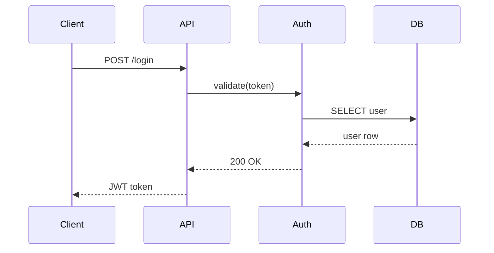

# Sequence Diagram Prompt

## Reasoning Rules

- Maximum 5 participants
- Order participants by appearance in the flow
- Time flows top-to-bottom
- Use activation bars to show processing time
- Annotate critical interactions

## Styling Constraints

- Maximum 5 colors
- Leave 120px margin
- Consistent arrow styles: solid for sync, dashed for async
- Hand-drawn roughness: 1

## Mermaid Example

