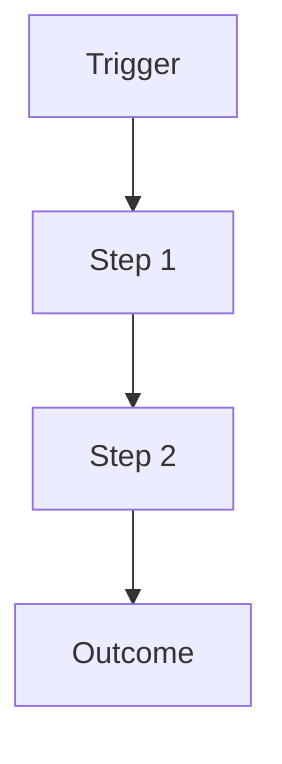

# Workflow Prompt

## Reasoning Rules

- Show the full process from trigger to outcome
- Maximum 8 steps
- Each step = one action or decision
- Parallel branches should be clearly labeled

## Styling Constraints

- Maximum 5 colors
- Leave 120px margin
- Consistent node sizes within same level
- Hand-drawn roughness: 1

## Mermaid Pattern

Use flowchart TD with labeled edges:

